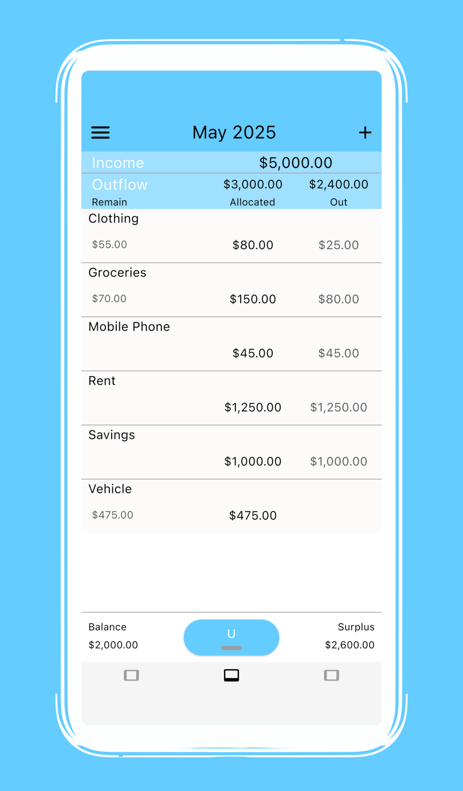

# uBudget

uBudget is a budgeting app that helps users track their expenses and manage their budget in an intuitive and lightweight design. It follows the **Model-View-ViewModel (MVVM)** architecture and offers key features like budget tracking, monthly summaries, and data security.

[Download on the App Store](https://apps.apple.com/us/app/ubudget/id1464366693)

## Architecture: MVVM

uBudget follows the **Model-View-ViewModel (MVVM)** architecture, ensuring:
- **Separation of Concerns**: UI logic is decoupled from business logic.
- **Scalability**: Easy to maintain and extend functionality.
- **Testability**: ViewModel is isolated for unit testing.

### High Level

1. **View**: Displays data and handles user interaction.
2. **ViewModel**: Contains app logic and transforms data for the View.
3. **Model**: Represents the data structure.
4. **Repository**: Abstracted database layer to handle data storage and retrieval.

---

## Design and Technology Stack

uBudget was initially built using **Xamarin.Forms** and later migrated to **.NET MAUI** to improve performance and cross-platform compatibility.

- **Xamarin.Forms**: Initially used to build the app with a shared codebase for iOS and Android.
- **.NET MAUI**: Updated to MAUI to take advantage of its modern features, enhanced performance, and better support for all platforms.

---

## Key Features
- **Budget Tracking**: Categorize and monitor your expenses.
- **Monthly Summary**: Overview of income, expenses, and remaining budget.
- **Lightweight Design**: Intuitive user interface.
- **Data Security**: All data processing on the device and no tracking of user budget data.

---

## Screenshot

---
